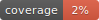

# Project Lockdown



Ideas are being brainstormed [here](https://scalesec.atlassian.net/wiki/spaces/CON/pages/615809029/GCP+Auto+Remediation+Suite+for+High+Risk+Events+Project+Lockdown) Please add suggestions!


[](https://github.com/marketplace/actions/super-linter)


## Introduction
Project Lockdown is a suite of serverless event-driven auto remediation Cloud Functions designed to react to unsecure resource creations or configurations. Project Lockdown is meant to be deployed in a GCP environment and has the capabilities to monitor and remediate across your entire Organization hierarchy in a matter of seconds. 

## Why is this needed?
Project Lockdown was born out of a common theme from our customers - there are certain configurations or events that they do not want to happen but there are currently no provider-native controls available to prevent these actions. For example, making a [GCS bucket](https://cloud.google.com/storage/docs/access-control/making-data-public) or [BigQuery dataset](https://cloud.google.com/bigquery/docs/datasets-intro) that stores sensitive information public puts your data at risk and it can only take minutes for malicious individuals to find those resources and exfiltrate data. 

There are compensating controls like the Organization Policy [constraint](https://cloud.google.com/resource-manager/docs/organization-policy/org-policy-constraints) `constraints/iam.allowedPolicyMemberDomains` that attempt to prevent GCS buckets from being made public but have potentially negative side effects. Organizations must constantly keep a running list of G Suite IDs and track where and when hierarchies are broken which maybe be viewed as too much effort.

Project Lockdown aims to be a safe, lightweight, and inexpensive tool to increase your security posture.

## How does it work? ##TODO: ADD INFRA DIAGRAM
Project Lockdown works by using a very efficient dataflow that takes advantage of GCP's [Cloud Logging](https://cloud.google.com/logging/docs/basic-concepts) advanced query log sinks. By configuring a filter (query) as specific as possible on the log sink we are able to only invocate a Cloud Function when necessary to remediate events deemed high risk or unsecure. 

When a target event is captured by the log sink it is sent to a Cloud Pub/Sub topic that triggers a Cloud Function automatically. This Cloud Function analyzes the event payload and extracts the data necessary for it to evaluate the current unsecure resource's configuration. If the Cloud Function determines that the resource is misconfigured according to its evaluation logic it will remediate the resource and configure it in a safe manner. Typically the action taken by the Cloud Function is a reversal of the event. If a bucket was made public, it is made private. If a firewall rule is created open to the public (0.0.0.0/0), it is removed. 

## How can I trust this?
Trust is a key component of any security tool so we have built Project Lockdown with that in mind. A few examples of this are:
- __Least privilege access.__ The Cloud Function that performs actions in your environment has only the permissions it needs to perform its programmed actions. No predefined roles are used and only custom purpose-driven roles are assigned.
- __View-only by default.__ Project Lockdown will not take action in your environment unless you configure it to do so. Out of the box Project Lockdown is view only.
- __Isolated workloads.__ Each use-case or Cloud Function has it's own custom role, it's own service account and its own separate Pub/Sub topic to receive events. The only shared resource between the different remediation modules is a Pub/Sub topic where you can subscribe to for alerts.

## Can I contribute or request features?
We welcome any questions, bug reports, feature requests or enhancements via a GitHub Issue or Pull Requests. If you plan to contribute to Project Lockdown please follow our [Contribution Guidelines](docs/CONTRIBUTING.md) for suggestions and requirements.


## Usage 

### Requirements

* Docker
* Make
* Bash

### Local Testing

This will run the container with tests and generate code coverage.

```shell
make test
```

### Terraform

Edit `terraform.tfvars` and add an entry in `enabled_modules` for the desired function. 

Functions not specified in this mapping will not be enabled and will be skipped. This uses a single module. 
